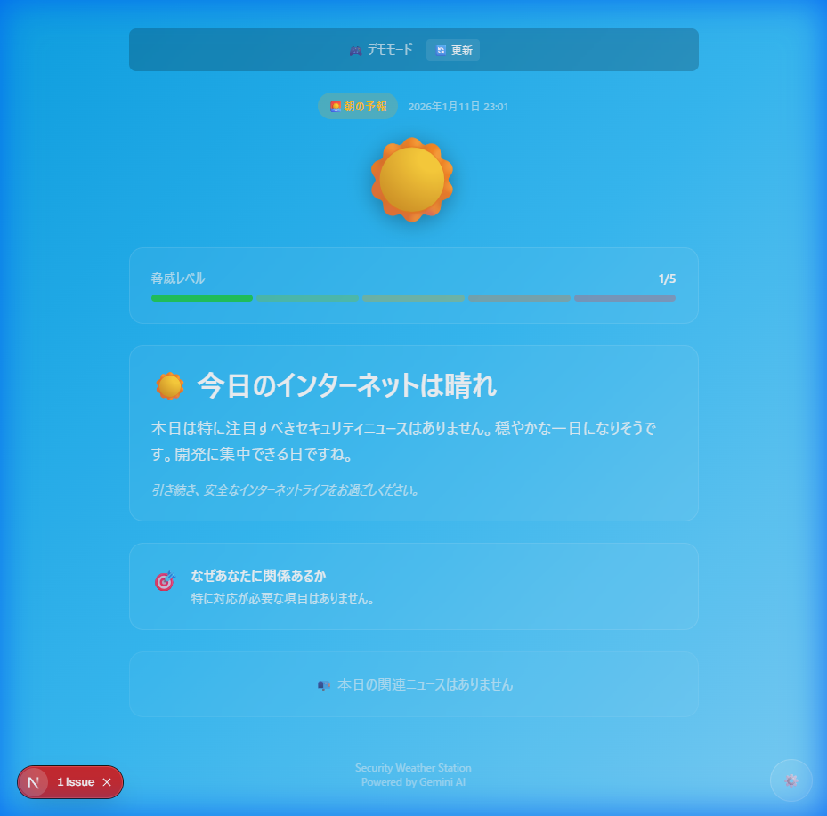

# Security Weather Station 🌦️

> **「今日のインターネットは荒れ模様です」**

セキュリティニュースを「天気予報」として可視化する、個人向けAIダッシュボード。

[](https://github.com/mjurymaru-blip/security-weather-station/actions/workflows/deploy.yml)

**[🌐 Live Demo](https://mjurymaru-blip.github.io/security-weather-station/)**

---

## ✨ Demo



| 天気 | 意味 | トリガー条件 |
|------|------|--------------|
| ☀️ 晴れ | 平穏 | 関連ニュースなし or 低脅威 |
| ⛅ 曇り | 注意 | 中程度の脆弱性報告あり |
| 🌧️ 雨 | 警戒 | 高関連度の脅威を検出 |
| ⛈️ 嵐 | 緊急 | 複数の高脅威 + 高関連度 |

---

## Philosophy

Security Weather Station does not aim to provide complete or authoritative security analysis.

Instead, it answers a simpler question:

> **"Do I need to care about this today?"**

This app is intentionally opinionated toward **individual developers**.

---

## 🛡️ Security & Privacy

### APIキーの保護

- **BYOK (Bring Your Own Key)** - あなたの鍵はブラウザの外へは一切送信されません
- **暗号化オプション** - マスターパスワードでAPIキーを暗号化して保存可能
- **Web Crypto API** - PBKDF2 (600,000回) + AES-GCM による業界標準の暗号化
- **Session Storage** - 復号後のキーはタブを閉じると自動消去

### セキュリティ上の注意

> ⚠️ **XSSは完全には防げません**
>
> 暗号化しても、復号後はJavaScriptのメモリ上にキーが存在します。
> これは「盗まれにくくする」対策であり、「盗めなくする」対策ではありません。

*This encryption is designed to reduce accidental exposure, not to provide absolute protection against a compromised browser.*

---

## Features

- 🌤️ **天気メタファー** - CVSSスコアを直接見せず、直感的な天気表現で危険度を可視化
- 🧭 **Orchestrator Agent** - AIがAIを制御。ニュース量に応じて分析戦略を動的に決定
- 🎯 **個人向けフィルタリング** - あなたの技術スタック（Linux, Docker, Next.js等）に基づく関連度判定
- 🌅 **時間軸** - 朝は予報、夜は振り返り
- 📱 **PWA対応** - スマホにインストールしてネイティブアプリのように使用

---

## Architecture

```
Collector → Orchestrator → Analyst → Narrator → Dashboard
   🛰️           🧭           🔬         📝          🖥️
```

| Agent | Role |
|-------|------|
| 🛰️ Collector | JPCERT/IPA/JVN からニュース収集 |
| 🧭 Orchestrator | 戦略決定（brief/normal/deep）とトーン制御 |
| 📊 Weather Scorer | Volume/Severity/Relevance/Trend の複合スコアで天気判定 |
| 🔬 Analyst | 技術的分析と脅威レベル評価 |
| 📝 Narrator | 人が読みたい文章に整形 |

### スコアリングロジック

天気判定は**AIに依存しない決定論的ルール**で行われます：

```
compositeScore = volume×0.15 + severity×0.30 + relevance×0.35 + trend×0.20
```

| スコア範囲 | 天気 |
|------------|------|
| 0.00 - 0.25 | ☀️ 晴れ (sunny) |
| 0.25 - 0.45 | ⛅ 曇り (cloudy) |
| 0.45 - 0.65 | 🌧️ 雨 (rainy) |
| 0.65 - 1.00 | ⛈️ 嵐 (stormy) |

> ⚠️ **AIは判断しない**: 天気スコアは計算式で確定し、AIはナレーション生成のみを担当

---

## Getting Started

### GitHub Pagesで使用（推奨）

1. [Live Demo](https://mjurymaru-blip.github.io/security-weather-station/) にアクセス
2. 設定（⚙️）を開く
3. [Google AI Studio](https://aistudio.google.com/app/apikey) でAPIキーを取得
4. APIキーを入力して保存

### ローカル開発

```bash
# Install dependencies
npm install

# Run development server
npm run dev
```

Open [http://localhost:3000](http://localhost:3000)

---

## Tech Stack

- **Framework**: Next.js 16 (App Router, Static Export)
- **Styling**: Tailwind CSS
- **AI**: Google Gemini (`@google/generative-ai`)
- **Deployment**: GitHub Pages (PWA)

---

## License

MIT
