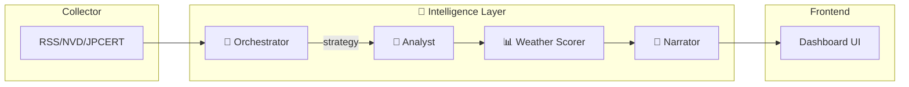

# 実装計画 - Security Weather Station (セキュリティ気象予報AI)

## 目標

セキュリティニュース（CVE, JPCERTなど）を集約し、**マルチエージェント構造**で分析、「天気予報」として可視化するWebアプリケーションを構築する。

> [!IMPORTANT]
> **思想**: このアプリは「完全なセキュリティ分析」を目指さない。  
> 答えるのは一つの問い：**「今日、自分はこれを気にする必要があるか？」**

---

## ユーザー確認事項

> [!IMPORTANT]
> - **API Key**: 環境変数 `GEMINI_API_KEY` が必要
> - **プロジェクトテンプレート**: ✅ 適用済み

---

## 技術スタック

| 項目 | 選定 |
|------|------|
| フレームワーク | Next.js (App Router) |
| スタイリング | Tailwind CSS (天気テーマパレット) |
| AI | Google Generative AI SDK (`@google/generative-ai`) |
| テンプレート | ✅ 適用済み (`.agent/workflows` 含む) |

---

## アーキテクチャ



---

## Agent 詳細

### 1. 🛰️ Collector Service

指定ソース（RSS, JSON API）からデータを取得し、標準フォーマットに正規化。

```typescript
interface NewsItem {
  id: string;
  title: string;
  source: 'nvd' | 'jpcert' | 'rss';
  publishedAt: Date;
  cvssScore?: number;
  affectedSystems?: string[];
  rawContent: string;
}
```

---

### 2. 🧭 Orchestrator Agent（司令塔）

> **AntiGravityの核心**: AIがAIを使い分ける構造

**役割:**
- 今日のニュース量・深刻度を評価
- 深掘り or 簡略化を判断
- Analystへ渡すPromptのトーンを制御

**入力:** `NewsItem[]`  
**出力:**
```json
{
  "strategy": "brief | normal | deep",
  "tone": "calm | cautious | alert",
  "reason": "CVE volume is low, but one is highly relevant to Docker",
  "focusItems": ["CVE-2025-XXXX"]
}
```

**Prompt例:**
```
あなたはサイバー気象予報センターの司令塔です。
本日のニュース一覧を確認し、以下を判断してください：
- strategy: brief（簡潔）/ normal / deep（深掘り）
- tone: calm（静穏）/ cautious（注意）/ alert（警戒）
- focusItems: 特に注目すべき項目のID
ユーザーの技術スタック: Linux, Docker, Next.js, PostgreSQL
```

---

### 3. 📊 Weather Scorer（天気判定システム）

> **思想**: AIに全判断を任せない

**複合要因スコアリング:**

| 要素 | 説明 | 重み |
|------|------|------|
| Volume | 今日の関連ニュース数 | 0.2 |
| Severity | CVSS / 影響度の最大値 | 0.3 |
| Relevance | 技術スタック一致率 | 0.35 |
| Trend | 昨日比（増加/減少） | 0.15 |

**天気マッピング:**
```typescript
type WeatherCondition = 'sunny' | 'cloudy' | 'rainy' | 'stormy';

function calcWeather(scores: WeatherScores): WeatherCondition {
  const total = 
    scores.volume * 0.2 +
    scores.severity * 0.3 +
    scores.relevance * 0.35 +
    scores.trend * 0.15;
  
  if (total < 0.25) return 'sunny';
  if (total < 0.50) return 'cloudy';
  if (total < 0.75) return 'rainy';
  return 'stormy';
}
```

---

### 4. 🔬 Analyst Agent

Orchestratorの戦略に従い、技術的分析を実行。

**入力:** `NewsItem[]` + `OrchestratorOutput`  
**出力:**
```json
{
  "weather_condition": "rainy",
  "threat_level": 3,
  "summary": "DockerのリモートAPI脆弱性が報告。ローカル環境では影響軽微。",
  "relevance_reason": "Dockerを利用中のため要確認",
  "analyzed_items": [...]
}
```

---

### 5. 📝 Narrator Agent

分析結果を「人が読みたい文章」に整形。

**モード:**
- **朝 (Forecast):** 「今日のインターネットは曇り空。傘は不要ですが、Docker周りに注意。」
- **夜 (Review):** 「本日の予報は概ね的中。新規の嵐は観測されませんでした。」

---

## Frontend（Dashboard）

### Hero Section
- 大きな天気アイコン + ステータス
- 「今日のインターネットは ○○ です」

### Relevance Card
- 「なぜあなたに関係あるか」を3行で

### News Feed
- 天候判定の根拠となったニュースリスト
- 重要度順にソート

### 時間軸表示
- 朝: **予報モード** (Forecast)
- 夜: **振り返りモード** (Review)

---

## 検証計画

### 自動テスト
- `npm run dev` でローカル起動確認
- Agent単体テスト（モックデータ使用）

### 手動検証
- 実際のRSSフィードを取得して天気判定を確認
- 朝/夜モードの切り替え動作確認

---

## Philosophy（README用）

```markdown
## Philosophy

Security Weather Station does not aim to provide
complete or authoritative security analysis.

Instead, it answers a simpler question:

> "Do I need to care about this today?"

This app is intentionally opinionated toward individual developers.
```