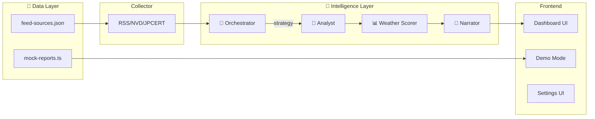

# 実装計画 - Security Weather Station (セキュリティ気象予報AI)

## 目標

セキュリティニュース（CVE, JPCERTなど）を集約し、**マルチエージェント構造**で分析、「天気予報」として可視化するWebアプリケーションを構築する。

> [!IMPORTANT]
> **思想**: このアプリは「完全なセキュリティ分析」を目指さない。  
> 答えるのは一つの問い：**「今日、自分はこれを気にする必要があるか？」**

---

## 技術スタック

| 項目 | 選定 |
|------|------|
| フレームワーク | Next.js 16 (App Router) |
| スタイリング | Tailwind CSS (天気テーマパレット) |
| AI | Google Generative AI SDK (`@google/generative-ai`) |
| データ管理 | JSON ファイル（camp-checklist方式） |
| 状態管理 | localStorage（クライアント設定） |

---

## アーキテクチャ



---

## Agent 詳細

### 1. 🛰️ Collector Service

指定ソース（RSS, JSON API）からデータを取得し、標準フォーマットに正規化。

**ソース管理**: `src/data/feed-sources.json`
- JPCERT/CC ✅
- IPA セキュリティ情報 ✅
- JVN 脆弱性情報 ✅
- NVD (オプション)
- CISA (オプション)
- GitHub Advisories (オプション)

```typescript
interface NewsItem {
  id: string;
  title: string;
  source: 'nvd' | 'jpcert' | 'rss';
  publishedAt: Date;
  cvssScore?: number;
  affectedSystems?: string[];
  rawContent: string;
}
```

---

### 2. 🧭 Orchestrator Agent（司令塔）

> **AntiGravityの核心**: AIがAIを使い分ける構造

**役割:**
- 今日のニュース量・深刻度を評価
- 深掘り or 簡略化を判断
- Analystへ渡すPromptのトーンを制御

**出力:**
```json
{
  "strategy": "brief | normal | deep",
  "tone": "calm | cautious | alert",
  "reason": "CVE volume is low, but one is highly relevant to Docker",
  "focusItems": ["CVE-2025-XXXX"]
}
```

---

### 3. 📊 Weather Scorer（天気判定システム）

> **思想**: AIに全判断を任せない

**複合要因スコアリング:**

| 要素 | 説明 | 重み |
|------|------|------|
| Volume | 今日の関連ニュース数 | 0.2 |
| Severity | CVSS / 影響度の最大値 | 0.3 |
| Relevance | 技術スタック一致率 | 0.35 |
| Trend | 昨日比（増加/減少） | 0.15 |

---

### 4. 🔬 Analyst Agent

Orchestratorの戦略に従い、技術的分析を実行。

---

### 5. 📝 Narrator Agent

分析結果を「人が読みたい文章」に整形。

**モード:**
- **朝 (Forecast):** 「今日のインターネットは曇り空。傘は不要ですが、Docker周りに注意。」
- **夜 (Review):** 「本日の予報は概ね的中。新規の嵐は観測されませんでした。」

---

## Frontend

### ダッシュボード (`/`)
- 天気アイコン + ステータス
- 脅威レベルゲージ
- 3行要約カード
- 関連性説明カード
- ニュースリスト

### デモモード
- URLパラメータで天気切替: `/?weather=stormy`
- モックデータ: `src/data/mock-reports.ts`

### 設定UI（予定）
- APIキー入力（localStorage保存）
- 技術スタック設定
- RSSソース有効/無効切替

---

## camp-checklist との設計共通点

| 項目 | camp-checklist | Security Weather Station |
|------|----------------|--------------------------|
| データ管理 | JSONファイル（レシピ） | JSONファイル（RSSソース） |
| APIキー | localStorage | localStorage（予定） |
| AI連携 | Gemini Pro | Gemini Pro |
| オフライン | PWA対応 | PWA対応（予定） |

---

## 次のステップ

1. **クライアント設定UI** - APIキー入力、localStorage保存
2. **PWA対応** - Service Worker、manifest.json
3. **実データテスト** - 本物のRSSフィードで動作確認

---

## Philosophy

Security Weather Station does not aim to provide complete or authoritative security analysis.

Instead, it answers a simpler question:

> **"Do I need to care about this today?"**

This app is intentionally opinionated toward individual developers.